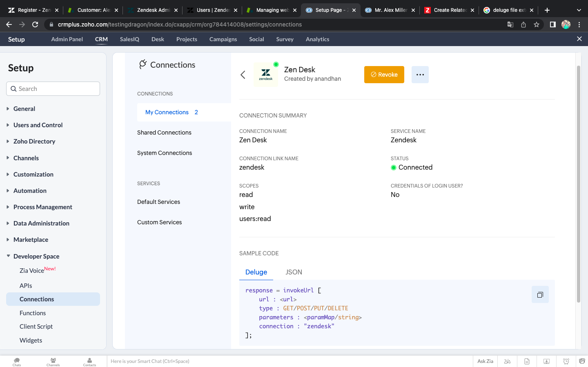
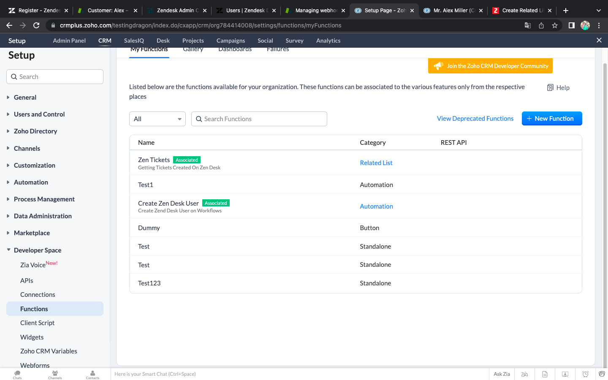
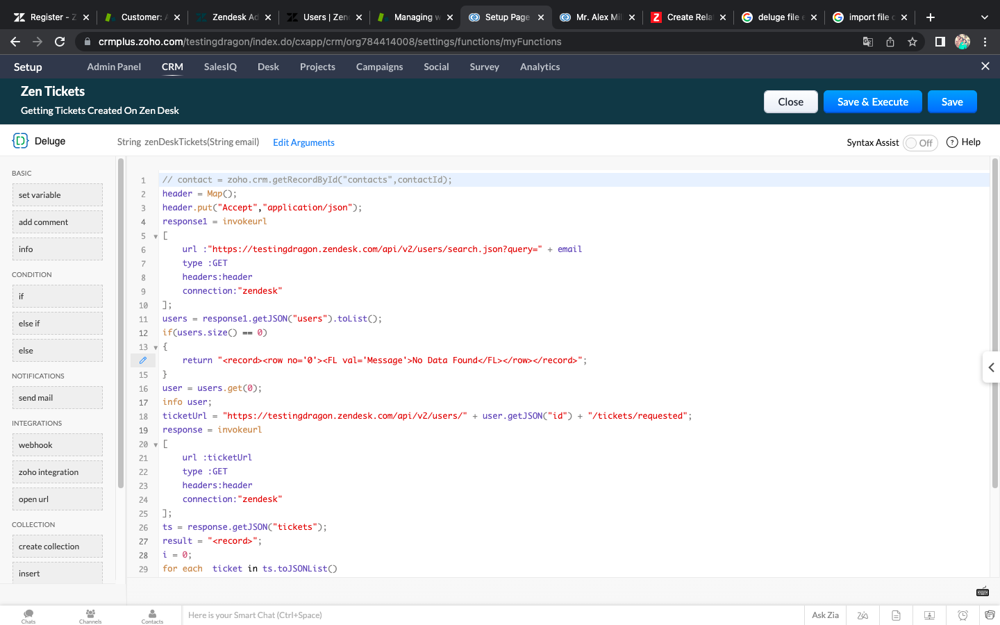
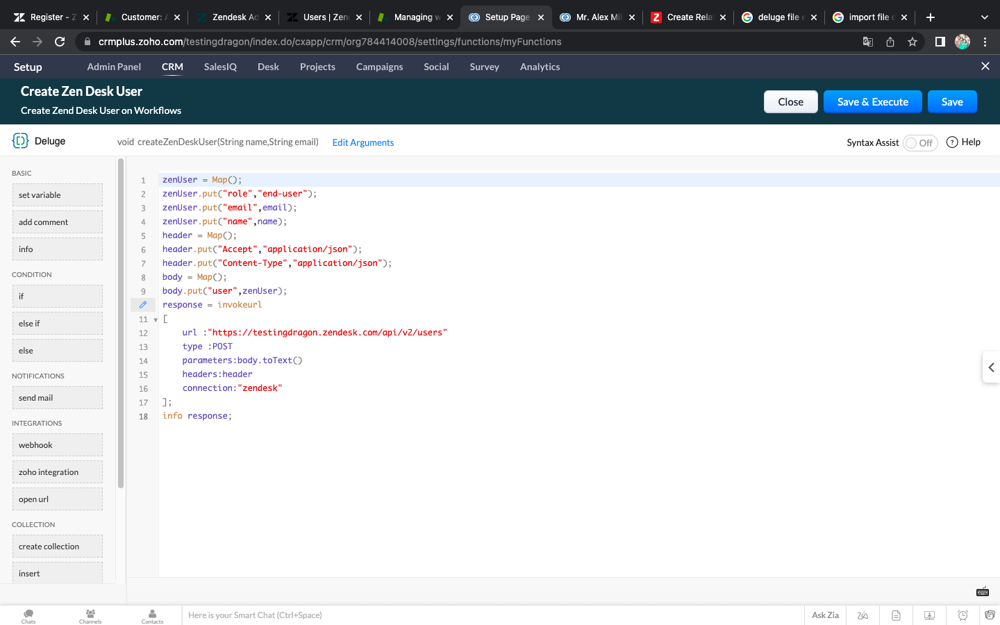
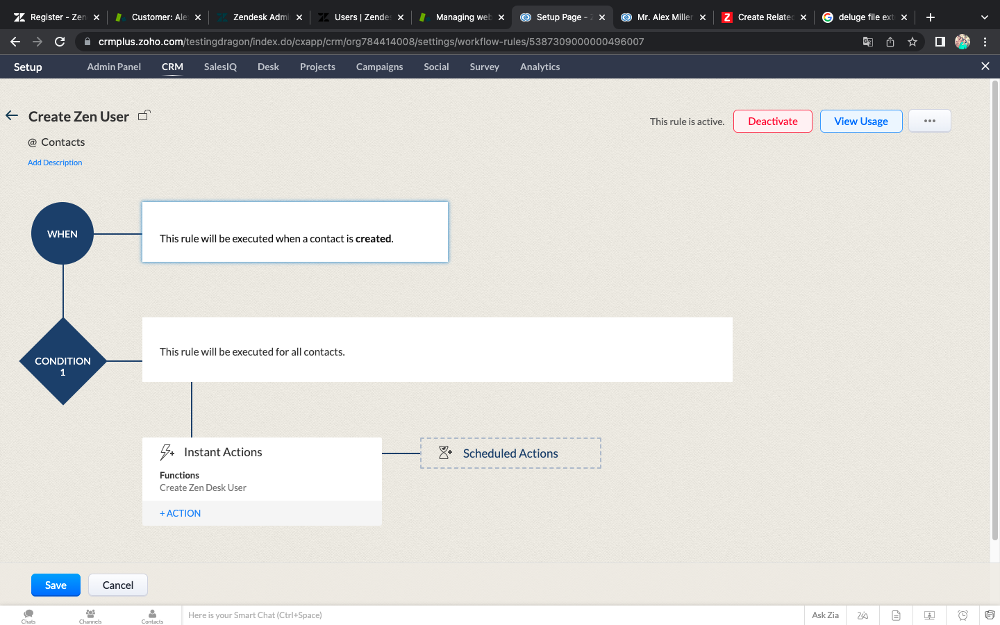
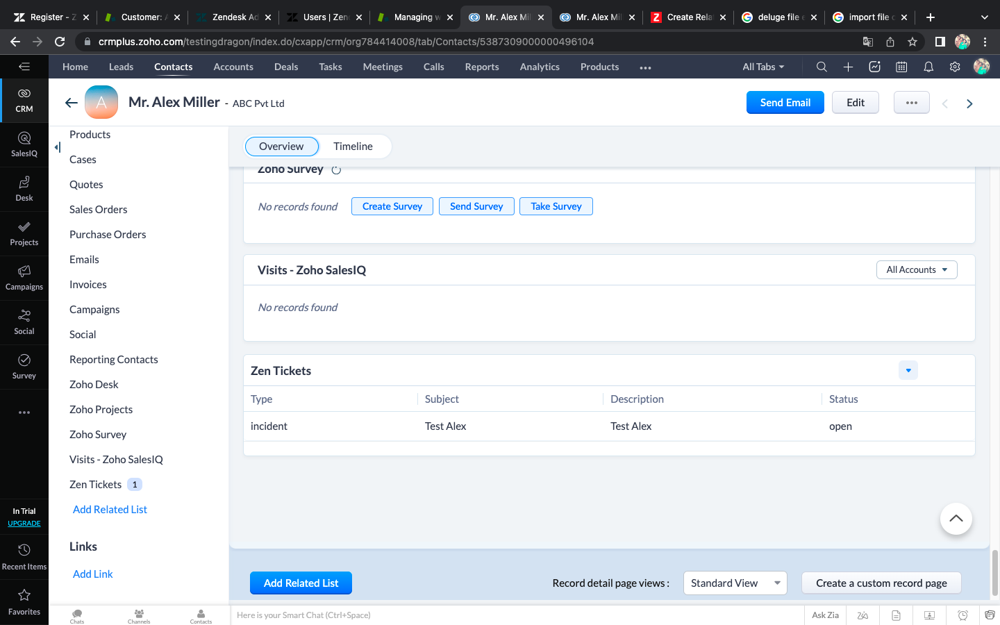

# ZenDesk Integration

## Integrating Zen Desk Tickets with Zoho CRM Contacts

## Step 1 - Get Zen Desk Subdomain:-

- Create Zen Desk Account
- Note Zen Desk Subdomain Url

## Step 2 - Create Zen Desk Connection in Zoho CRM:-

- Open Zoho CRM
- Go to Setup -> Developer Space -> Connections.
- Click on Create Connection
- Select ZenDesk from Default Services
- Enter Connection Name and Connection Link Name
- Scopes select read,write,users:read
- Click on Create And Connect Button
- ZenDesk Connection Page will be appear and enter ZenDesk Subdomain url and authorize

## Step 3 - Create Two Functions

1. To Get Tickets from ZenDesk

2. To Create User in ZenDesk

## Step 4 - Create Workflow for Contact Creation and Attach The CreateUser Function with it

## Step 5 - Create New Related List in Contact Detail Page and Attach Get Ticket Function with it

## Execution Demo

##### Execution Demo Available on the following location 

